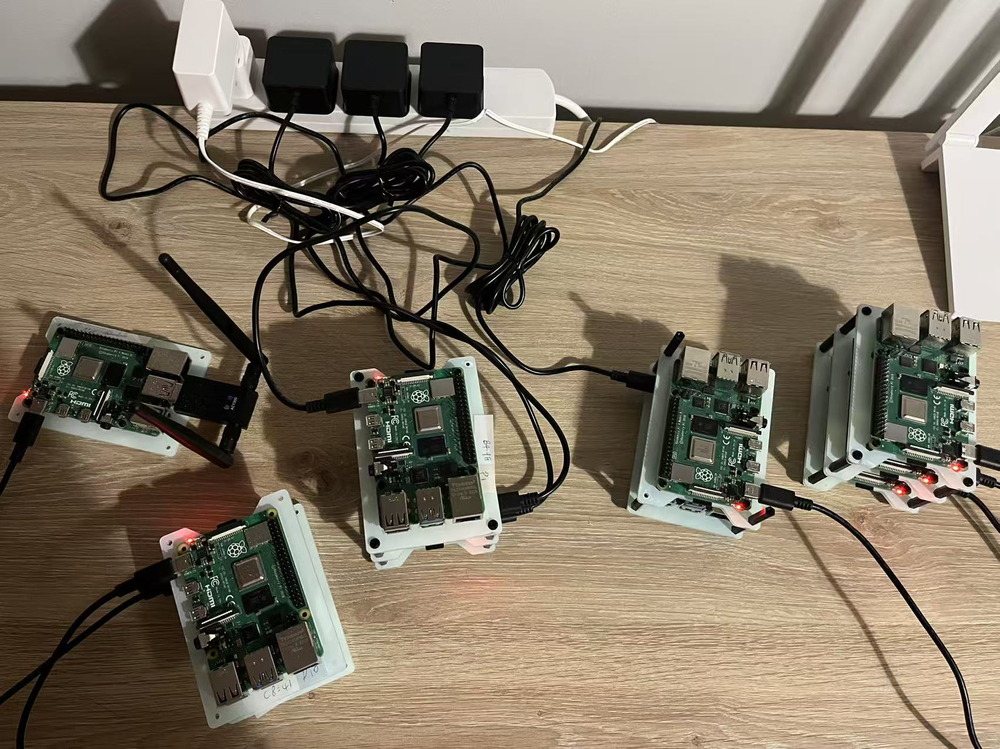

# CSC8114 Group 9 — Adaptive Joint Compression and Synchronisation in Federated Split Learning for IoT Rainfall Prediction

> A research prototype / experimental platform Federated Split Learning system with adaptive communication control for real-time IoT rainfall prediction.

## Overview

In real-world IoT sensing networks, distributed weather stations continuously generate large volumes of environmental data. Traditional centralised training requires raw data to be transmitted to a central server — introducing **privacy risks**, **high bandwidth costs**, and **single points of failure**. Federated Split Learning (FSL) addresses this by splitting the neural network between edge clients and a central server: clients compute only the early layers locally and transmit compact intermediate activations instead of raw data.

However, FSL introduces its own communication bottleneck — **per-step activation/gradient round trips** and **periodic model synchronisation** can dominate training time under constrained or unstable IoT networks. This project tackles this problem head-on.

<p align="center">
  
</p>

### What We Built

A fully functional, end-to-end FSL training platform built on a **gRPC microservice architecture** with the following core components:

- **Split LSTM Model** — A 2-layer LSTM encoder runs on each client to extract temporal weather features from a 48-hour sliding window (5 meteorological variables), producing a fixed-size 64-dim _smashed activation_. The server hosts a dual-head prediction module (rain/no-rain classifier + rainfall amount regressor) and uses focal loss plus positive-sample rebalancing to handle rainfall class imbalance.

- **gRPC Communication Layer** — Four well-defined RPCs (`Register`, `Forward`, `Synchronize`, `NotifyCompletion`) orchestrate the full distributed training lifecycle, including client registration, split forward/backward passes, barrier-based FedAvg aggregation (with configurable quorum and timeout), and graceful shutdown.

- **Adaptive Communication Scheduler** — A latency-aware, rule-based scheduler running on the server side that jointly controls two optimisation dimensions at runtime:
  - **Spatial** — Activation/gradient compression mode (float32 → float16 → int8), reducing per-step payload from 256 B to 68 B.
  - **Temporal** — Synchronisation interval ρ, dynamically moving from 1 to 3 in the evaluated adaptive regimes while retaining a configured safety range of 1–20.
  
  Decisions are driven by EMA-smoothed client-reported latency, enabling the system to dynamically adapt to heterogeneous and non-stationary network conditions without manual tuning.

- **Reproducible Experiment Matrix** — 17 simulation scenarios × 3 random seeds, systematically decoupling the effects of latency profiles (none / low / high / mixed), compression modes, synchronisation intervals, and adaptive vs. static policies. A second four-scenario Raspberry Pi matrix validates the same ideas on physical edge devices over a real wide-area link.

### Key Results

Measured across the updated paper experiments. Simulation metrics use 17 scenarios × 3 seeds; Raspberry Pi metrics use 4 scenarios × 3 seeds.

| Finding | Detail |
| ------- | ------ |
| Simulation AUPRC stability | AUPRC remains stable across all 17 scenarios (**0.6381–0.6484**), showing no measurable degradation from int8 compression or ρ=3 synchronisation. |
| INT8 compression | Per-step activation payload falls from **256 B to 68 B** while AUPRC stays within seed-level variance of the float32 baseline. |
| ρ = 3 synchronisation | Synchronisation traffic drops by about **53%** in simulation, from roughly 6.7 MB to 3.19 MB, while AUPRC remains stable. |
| Joint adaptive simulation | H16 reaches the lowest simulation communication cost: **0.55 MB total activation payload** and **3.19 MB sync traffic**. |
| Raspberry Pi deployment | P4 adaptive reduces activation payload by **87%** and synchronisation traffic by **54%** vs. P1, while keeping AUPRC within 0.011 of all Pi scenarios. |
| Runtime stability on real hardware | P4 reduces runtime jitter from **±688 s** (P1) to **±10 s** on Raspberry Pi. |

The central paper result is that FSL communication cost can be reduced by an order of magnitude without sacrificing predictive performance when activation compression and synchronisation frequency are controlled jointly rather than independently.

---

## Repository Structure

```
csc8114/
├── code/                        # FSL system implementation
│   ├── config.yaml              # Runtime config — model, training, data, comms
│   ├── matrix.yaml              # Experiment matrix — 17 simulation scenarios & seeds
│   ├── Makefile                 # Build / run / plot automation
│   ├── proto/fsl.proto          # gRPC protocol (4 RPCs)
│   ├── src/
│   │   ├── models/              # ClientLSTM (encoder) + ServerHead (predictor)
│   │   ├── nodes/               # Server and client entry points
│   │   ├── client/              # Training loop, forward step, sync, checkpointing
│   │   ├── server/              # Forward service, FedAvg, adaptive scheduler
│   │   ├── shared/              # Compression, serialisation, config, runtime
│   │   └── data/                # Data download, evaluation, plotting
│   ├── dataset/
│   │   └── processed/           # 11 station files (one per federated client)
│   ├── bestweights/             # Model checkpoints (per session)
│   └── results/                 # Training logs, evaluation reports, plots
│
└── paper/                       # IEEE conference paper (IEEEtran)
    ├── csc8114 assessment1.tex  
    ├── csc8114.tex              # Main paper
    ├── refs.bib                 # Bibliography
    └── diagrams/                # Architecture & sequence diagrams (Mermaid + PNG)
```

---

## Quick Start

### Prerequisites

- Python 3.11+ with [uv](https://docs.astral.sh/uv/)
- (Optional) Docker & Docker Compose for containerised runs
- (Optional) TeX Live for paper compilation

### Environment Setup

```bash
cd code/
uv sync
```

### Data Download

```bash
make download-data
```

Downloads Open-Meteo/ERA5 historical weather data (2015-01-01 to 2026-03-31) for 11 Newcastle-area stations:

- **11 federated client locations** → `dataset/processed/` (one station file per client)
- Chronological split: train before 2024-01-01, validation during 2024, test from 2025-01-01 to 2026-03-31
- Input: previous 48 hours of temperature, humidity, pressure, wind speed, and rain
- Target: cumulative rainfall over the next 24 hours; rain label is positive when future 24-hour rainfall is at least 0.5 mm

### Training (Native — Recommended for development)

```bash
make native-clean
make native-run                                         # uses config.yaml defaults
make native-run NUM_CLIENTS=3                           # quick local smoke test
make native-run CLIENT_DEVICE=mps                       # use Apple Silicon GPU
```

### Training (Docker — single machine)

```bash
make docker-run NUM_CLIENTS=11   # server + 11 clients in containers
make docker-clean                # teardown
```

### Training (Distributed — VPS server + 11 Raspberry Pis)

Prerequisites: Tailscale overlay network set up, `ansible/inventory.ini` populated, Docker image pushed to Docker Hub.

```bash
# First time or after code changes: build and push a new image
make dist-build IMAGE_TAG=sha-abc123

# Sync configs, restart server on VPS, deploy clients to all Pis
make dist-start IMAGE_TAG=sha-abc123

# Follow live server logs
make dist-logs

# Fetch results back to Mac when done
make dist-fetch
```

For a full experiment matrix over the cluster:

```bash
make matrix BACKEND=dist
```

Each scenario's merged config is automatically pushed to VPS and all Pis before that scenario starts — clients always run with the correct overrides applied.

To wipe everything and start fresh:

```bash
make dist-restart
```

### Evaluation & Plotting

```bash
# Re-evaluate all 17 scenarios
bash run_eval_all.sh

# Or evaluate a single scenario
uv run python src/data/run_evaluation.py \
    --session 2026-05-03_00-20-00 --scenario N01 \
    --eval-max-samples 0 --device mps

# Aggregate all eval reports into one CSV
uv run python src/data/build_matrix_summary.py

# Regenerate paper figures (output → results/graphics/)
uv run python src/data/plot_compression_auprc.py      # Fig 2
uv run python src/data/plot_efficiency_accuracy.py    # Fig 3
uv run python src/data/plot_cross_platform.py         # Fig 4
uv run python src/data/plot_rho_convergence.py        # Fig 5
uv run python src/data/plot_scheduler_timeline.py     # Fig A
uv run python src/data/plot_monthly_performance.py    # Fig B
```

### Experiment Matrix

Scenarios and seeds are defined in `matrix.yaml`. Each scenario overrides `config.yaml` for that run only — processes never see the original base config during a matrix run.

```bash
make matrix-dry-run                        # preview scenario plan
make matrix                                # run all 17 scenarios × 3 seeds (native)
make matrix ONLY=L09,H15 MAX_RUNS=1        # run selected scenarios only
```

Run `make help` for the full command list.

---

## System Architecture

```
┌─────────────────────────────────────────────────────────┐
│                      gRPC Server                        │
│  ┌────────────┐  ┌───────────┐  ┌────────────────────┐  │
│  │ ServerHead │  │  FedAvg   │  │ Adaptive Scheduler │  │
│  │ (MLP+Dual  │  │ Coordinator│  │ (Compression + ρ)  │  │
│  │  Head)     │  │           │  │                    │  │
│  └────────────┘  └───────────┘  └────────────────────┘  │
└──────────┬──────────────┬──────────────┬────────────────┘
           │ Forward/     │ Synchronize  │ Register/
           │ Backward     │ (FedAvg)     │ Complete
           │              │              │
┌──────────▼──────────────▼──────────────▼────────────────┐
│              gRPC Clients (×11)                         │
│  ┌──────────┐  ┌──────────────┐  ┌──────────────────┐  │
│  │ClientLSTM│  │Training Loop │  │  Compression &   │  │
│  │(2L LSTM) │  │(local steps) │  │  Latency Report  │  │
│  └──────────┘  └──────────────┘  └──────────────────┘  │
└─────────────────────────────────────────────────────────┘
```

### Model (Split LSTM)

| Component      | Location                   | Description                                                                 |
| -------------- | -------------------------- | --------------------------------------------------------------------------- |
| **ClientLSTM** | `src/models/split_lstm.py` | 2-layer LSTM encoder; input (batch, 48, 5) → smashed activation (batch, 64) |
| **ServerHead** | `src/models/split_lstm.py` | MLP backbone → dual head: rain classifier (logit) + rain regressor (amount) |

### gRPC Protocol (`proto/fsl.proto`)

| RPC                | Direction       | Purpose                                                             |
| ------------------ | --------------- | ------------------------------------------------------------------- |
| `Register`         | Client → Server | Register client, receive assigned ID and session                    |
| `Forward`          | Client ↔ Server | Send compressed activation, receive gradient + scheduler directives |
| `Synchronize`      | Client ↔ Server | FedAvg weight aggregation (barrier-based with quorum + timeout)     |
| `NotifyCompletion` | Client → Server | Signal training complete; triggers shutdown when all clients finish |

### Adaptive Scheduler (`src/server/scheduler.py`)

Uses per-client EMA-smoothed latency to choose compression and synchronisation interval:

| Latency (EMA) | Compression Mode  | Severity | Resulting ρ with base=1, step=1 |
| ------------- | ----------------- | -------- | -------------------------------- |
| < 4 ms        | float32           | 0        | 1                                |
| 4–10 ms       | float16           | 1        | 2                                |
| ≥ 10 ms       | int8              | 2        | 3                                |

### Compression Modes (`src/shared/compression.py`)

| Mode    | Encoding                         | 64-dim Payload   |
| ------- | -------------------------------- | ---------------- |
| float32 | Raw numpy                        | 256 B            |
| float16 | Half-precision                   | 128 B            |
| int8    | Scale (4B) + quantised           | 68 B             |

---

## Configuration

Two config files, two responsibilities:

**`config.yaml`** — runtime config; what a single direct run actually uses:

| Section         | Description                                                         |
| --------------- | ------------------------------------------------------------------- |
| `model.*`       | LSTM hidden size, layers, sequence length, horizon                  |
| `training.*`    | Learning rate, rounds, local steps, loss weights, focal loss params |
| `compression.*` | Default mode (`float32`, `float16`, or `int8`)                      |
| `federated.*`   | Number of clients, base ρ                                           |
| `scheduler.*`   | Latency thresholds, ρ bounds, EMA alpha                             |
| `profiler.*`    | Synthetic latency generator (base, offsets, jitter, burst)          |
| `data.*`        | Dataset paths, train/val/test split boundaries                      |

**`matrix.yaml`** — experiment matrix; only read by `make matrix`:

| Section                        | Description                                        |
| ------------------------------ | -------------------------------------------------- |
| `experiment_matrix.seeds`      | Random seeds for repeated runs                     |
| `experiment_matrix.runner.*`   | Backend (native/docker), devices, timeout          |
| `experiment_matrix.scenarios`  | 17 scenario definitions with per-scenario overrides |

Each scenario in `matrix.yaml` deep-merges its `overrides` onto `config.yaml` to produce a fully resolved per-run config. Training processes only ever see this merged result — they never read `matrix.yaml` directly.

---

## Experiment Matrix (N01–M17)

Defined in `matrix.yaml`. 17 scenarios total, run with 3 seeds each. Results land in `results/<session>/<scenario>/` and `bestweights/<session>/<scenario>/`.

| ID  | Latency Profile    | Compression | ρ       | Scheduler      | AUPRC              | F1     | Payload/step |
| --- | ------------------ | ----------- | ------- | -------------- | ------------------ | ------ | ------------ |
| N01 | No latency         | float32     | 1       | Off            | 0.6396 ± 0.0032    | 0.6023 | 256.0 B      |
| N02 | No latency         | float16     | 1       | Off            | 0.6384 ± 0.0106    | 0.6052 | 128.0 B      |
| N03 | No latency         | int8        | 1       | Off            | 0.6395 ± 0.0078    | 0.5688 | 68.0 B       |
| N04 | No latency         | float32     | 3       | Off            | 0.6473 ± 0.0001    | 0.6075 | 256.0 B      |
| L05 | Low (~8 ms)        | float32     | 1       | Off            | 0.6409 ± 0.0070    | 0.5293 | 256.0 B      |
| L06 | Low (~8 ms)        | float16     | 1       | Off            | 0.6431 ± 0.0083    | 0.5831 | 128.0 B      |
| L07 | Low (~8 ms)        | int8        | 1       | Off            | 0.6422 ± 0.0061    | 0.6129 | 68.0 B       |
| L08 | Low (~8 ms)        | float32     | 3       | Off            | 0.6479 ± 0.0004    | 0.6185 | 256.0 B      |
| L09 | Low (~8 ms)        | dynamic     | 1       | Adaptive       | 0.6415 ± 0.0060    | 0.6358 | 92.5 B       |
| L10 | Low (~8 ms)        | dynamic     | dynamic | Adaptive + ρ   | 0.6474 ± 0.0004    | 0.5815 | 92.5 B       |
| H11 | High (~50 ms)      | float32     | 1       | Off            | 0.6393 ± 0.0057    | 0.6085 | 256.0 B      |
| H12 | High (~50 ms)      | float16     | 1       | Off            | 0.6421 ± 0.0053    | 0.6308 | 128.0 B      |
| H13 | High (~50 ms)      | int8        | 1       | Off            | 0.6407 ± 0.0099    | 0.5560 | 68.0 B       |
| H14 | High (~50 ms)      | float32     | 3       | Off            | 0.6484 ± 0.0004    | 0.6265 | 256.0 B      |
| H15 | High (~50 ms)      | dynamic     | 1       | Adaptive       | 0.6381 ± 0.0072    | 0.5640 | 68.0 B       |
| H16 | High (~50 ms)      | dynamic     | dynamic | Adaptive + ρ   | 0.6483 ± 0.0003    | 0.6222 | 68.0 B       |
| M17 | Mixed (per-client) | dynamic     | dynamic | Adaptive + ρ   | 0.6476 ± 0.0007    | 0.6368 | 128.2 B      |

### Raspberry Pi Deployment Matrix

The paper also validates four representative strategies on 11 Raspberry Pi 4B clients connected to a cloud server over a real wide-area link. The profiler is disabled; measured RTT is approximately 21–24 ms, which places the adaptive scheduler in the int8 + ρ=3 regime.

| ID | Strategy | Compression | ρ | AUPRC | Total Payload | Sync Traffic | Runtime |
| -- | -------- | ----------- | - | ----- | ------------- | ------------ | ------- |
| P1 | Baseline | float32 | 1 | 0.6381 ± 0.0052 | 47.36 ± 10.26 MB | 75.77 ± 16.42 MB | 3280.1 ± 688.0 s |
| P2 | Compression only | float16 | 1 | 0.6434 ± 0.0053 | 23.93 ± 5.91 MB | 76.57 ± 18.92 MB | 3318.4 ± 814.3 s |
| P3 | Sparse synchronisation | float32 | 3 | 0.6479 ± 0.0008 | 22.83 ± 0.00 MB | 35.06 ± 0.00 MB | 3331.4 ± 25.7 s |
| P4 | Joint adaptive | dynamic | dynamic | 0.6482 ± 0.0014 | 6.07 ± 0.00 MB | 35.06 ± 0.00 MB | 3316.5 ± 10.3 s |

---

## Ablation Study Results

Results averaged across 3 random seeds (42, 52, 62). Values shown as **mean ± std**.
Communication cost metrics (`total_payload_mb`, `sync_sent_mb`) are **summed** across seeds to reflect aggregate system cost.

| Scenario | AUPRC | ROC-AUC | F1 | total\_payload\_mb (sum) | sync\_sent\_mb (sum) | throughput\_sps | runtime\_s | mem\_peak\_mb | cpu\_percent | latency\_ms |
|---|---|---|---|---|---|---|---|---|---|---|
| P1: float32, rho=1 (Baseline) | 0.6542 ± 0.0062 | 0.7150 ± 0.0063 | 0.6287 ± 0.0428 | 2576.37 | 239.08 | 7.70 ± 1.63 | 16054.9 ± 3553.6 | 678.0 ± 52.2 | 19.2 ± 0.3% | 27.09 ± 0.28 |
| P2: float16, rho=1 | 0.6552 ± 0.0034 | 0.7165 ± 0.0030 | 0.5897 ± 0.0475 | 1360.11 | 252.43 | 7.29 ± 1.64 | 16968.6 ± 3500.9 | 688.1 ± 47.8 | 19.2 ± 0.5% | 27.13 ± 1.12 |
| P3: float32, rho=3 | 0.6612 ± 0.0004 | 0.7228 ± 0.0013 | 0.6289 ± 0.0490 | 1132.57 | 105.19 | 13.41 ± 0.22 | 8941.8 ± 149.2 | 535.7 ± 11.2 | 23.0 ± 0.2% | 27.59 ± 0.38 |
| **P4: Adaptive** | **0.6608 ± 0.0029** | **0.7247 ± 0.0056** | **0.6404 ± 0.0191** | **823.73** | **100.01** | **13.30 ± 0.55** | **9019.8 ± 381.1** | **536.5 ± 6.7** | **22.9 ± 0.2%** | **26.72 ± 1.16** |


## Output Structure

Each training session produces:

```
bestweights/<session>/<scenario>/
  ├── best_client_<i>_round_<r>_model_<ts>.pth   # best checkpoint per client
  └── periodic/
      ├── client_<i>_round_<r>.pth               # per-round paired checkpoints
      └── server_round_<r>.pth

results/<session>/
  ├── <scenario>/
  │   ├── training_log_client<i>_<ts>.csv         # step-level: loss, latency, payload
  │   ├── training_log_client<i>_meta.json        # best checkpoint path + config
  │   └── server_log_<session>.csv                # per-round aggregation
  ├── <scenario>_eval_report.csv/.json             # test metrics (source of truth)
  ├── graphics/                                   # paper figures (pdf + png)
  │   ├── fig2_compression_auprc.pdf/.png
  │   ├── fig3_efficiency_accuracy.pdf/.png
  │   ├── fig4_cross_platform.pdf/.png
  │   ├── fig5_rho_convergence.pdf/.png
  │   ├── figA_scheduler_timeline.pdf/.png
  │   └── figB_monthly_performance.pdf/.png
  └── matrix_summary.csv                          # one row per scenario, all key metrics
```

---

## Paper

The IEEE conference paper is in `paper/`. To compile:

```bash
cd paper/
pdflatex csc8114.tex
bibtex csc8114
pdflatex csc8114.tex
pdflatex csc8114.tex
```

> Run `pdflatex` three times to resolve all cross-references and citations.

Diagrams are authored in [Mermaid](https://mermaid.js.org/) and exported via [mermaid.live](https://mermaid.live/). Always edit and export from the website for consistency.

---

## Team

| Member        | Role                                 |
| ------------- | ------------------------------------ |
| Baoyi Liu     | Related Work & Writing               |
| Guanghua Liu  | Related Work & Writing               |
| Jiale Liu     | Introduction & Literature Review     |
| Wenjie Ding   | Methodology, System Design & Results |
| Yi Sin Lin    | System Design & Implementation       |

School of Computing, Newcastle University
